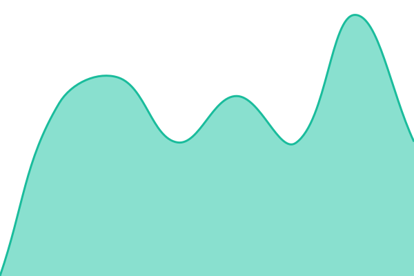
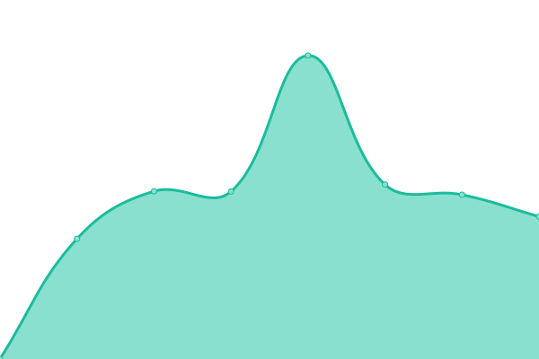
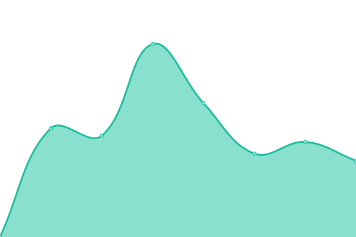
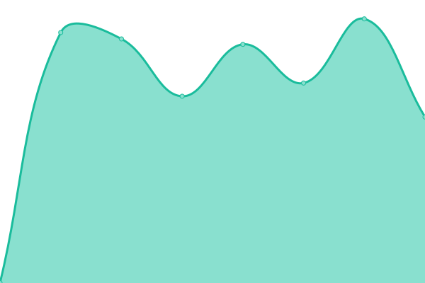
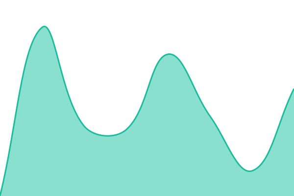
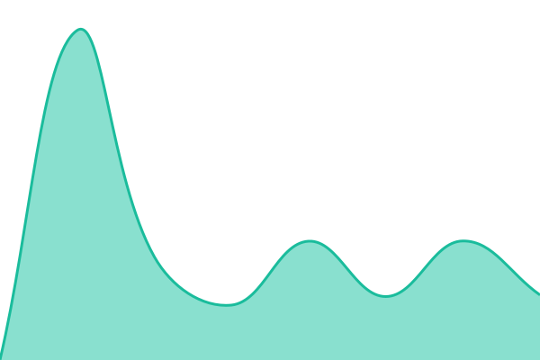
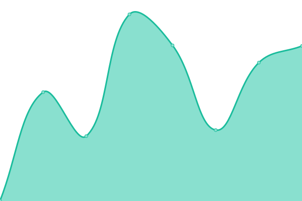
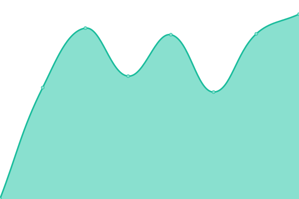
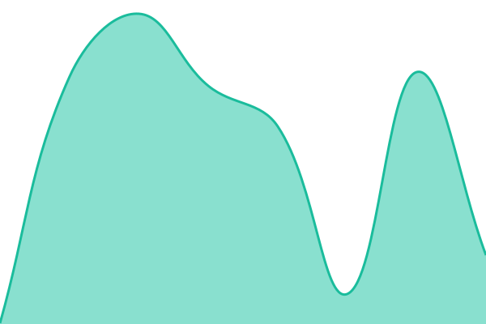

# [📈 Live Status](https://dHeraldDev.github.io/service-status): <!--live status--> **🟩 All systems operational**

This repository contains the open-source uptime monitor and status page for [dHeraldDev](https://dHeraldDev.github.io/service-status), powered by [Upptime](https://github.com/upptime/upptime).

With [Upptime](https://upptime.js.org), you can get your own unlimited and free uptime monitor and status page, powered entirely by a GitHub repository. We use [Issues](https://github.com/dHeraldDev/service-status/issues) as incident reports, [Actions](https://github.com/dHeraldDev/service-status/actions) as uptime monitors, and [Pages](https://dHeraldDev.github.io/service-status) for the status page.

<!--start: status pages-->
<!-- This summary is generated by Upptime (https://github.com/upptime/upptime) -->
<!-- Do not edit this manually, your changes will be overwritten -->
<!-- prettier-ignore -->
| URL | Status | History | Response Time | Uptime |
| --- | ------ | ------- | ------------- | ------ |
|  [bfMBA Static](https://mk.bfmba.ac.kr/) | 🟩 Up | [bf-mba-static.yml](https://github.com/dherald-dev/service-status/commits/HEAD/history/bf-mba-static.yml) | 

 272ms
     
 | 

<a href="https://dherald-dev.github.io/service-status/history/bf-mba-static">100.00%</a>
    

|  [bfMBA Web](https://bfmba.ac.kr) | 🟩 Up | [bf-mba-web.yml](https://github.com/dherald-dev/service-status/commits/HEAD/history/bf-mba-web.yml) | 

 2158ms
     
 | 

<a href="https://dherald-dev.github.io/service-status/history/bf-mba-web">100.00%</a>
    

|  [bfMBA LMS OLD](https://ajoumpamgr.dherald.com/) | 🟩 Up | [bf-mba-lms-old.yml](https://github.com/dherald-dev/service-status/commits/HEAD/history/bf-mba-lms-old.yml) | 

 1039ms
     
 | 

<a href="https://dherald-dev.github.io/service-status/history/bf-mba-lms-old">100.00%</a>
    

|  [bfMBA LMS NEW](https://lms.bfmba.ac.kr/) | 🟩 Up | [bf-mba-lms-new.yml](https://github.com/dherald-dev/service-status/commits/HEAD/history/bf-mba-lms-new.yml) | 

 1045ms
     
 | 

<a href="https://dherald-dev.github.io/service-status/history/bf-mba-lms-new">100.00%</a>
    

|  [iMBA Web](https://www.hufsimba.ac.kr/) | 🟩 Up | [i-mba-web.yml](https://github.com/dherald-dev/service-status/commits/HEAD/history/i-mba-web.yml) | 

 1467ms
     
 | 

<a href="https://dherald-dev.github.io/service-status/history/i-mba-web">100.00%</a>
    

|  [iMBA LMS](https://lms.hufsimba.ac.kr/) | 🟩 Up | [i-mba-lms.yml](https://github.com/dherald-dev/service-status/commits/HEAD/history/i-mba-lms.yml) | 

 1383ms
     
 | 

<a href="https://dherald-dev.github.io/service-status/history/i-mba-lms">100.00%</a>
    

|  [iMBA APPLY](https://apply.hufsintlgrad.ac.kr/) | 🟩 Up | [i-mba-apply.yml](https://github.com/dherald-dev/service-status/commits/HEAD/history/i-mba-apply.yml) | 

 1458ms
     
 | 

<a href="https://dherald-dev.github.io/service-status/history/i-mba-apply">100.00%</a>
    

|  [iMBA APPLY_LMS](https://apply-lms.hufsintlgrad.ac.kr/) | 🟩 Up | [i-mba-apply-lms.yml](https://github.com/dherald-dev/service-status/commits/HEAD/history/i-mba-apply-lms.yml) | 

 1208ms
     
 | 

<a href="https://dherald-dev.github.io/service-status/history/i-mba-apply-lms">100.00%</a>
    

|  [Ajoumpa Web](https://ajoumpa.ac.kr) | 🟩 Up | [ajoumpa-web.yml](https://github.com/dherald-dev/service-status/commits/HEAD/history/ajoumpa-web.yml) | 

 889ms
     
 | 

<a href="https://dherald-dev.github.io/service-status/history/ajoumpa-web">100.00%</a>
    

|  [Ajoumpa LMS OLD](https://ajoumpamgr.dherald.com/) | 🟩 Up | [ajoumpa-lms-old.yml](https://github.com/dherald-dev/service-status/commits/HEAD/history/ajoumpa-lms-old.yml) | 

 720ms
     
 | 

<a href="https://dherald-dev.github.io/service-status/history/ajoumpa-lms-old">100.00%</a>
    

|  [Ajoumpa LMS New](https://ajoumpamgr2.dherald.com/) | 🟩 Up | [ajoumpa-lms-new.yml](https://github.com/dherald-dev/service-status/commits/HEAD/history/ajoumpa-lms-new.yml) | 

 1284ms
     
 | 

<a href="https://dherald-dev.github.io/service-status/history/ajoumpa-lms-new">100.00%</a>
    

|  [Ajoumpa LMS Cooperate](https://ajoumpaco.dherald.com/) | 🟩 Up | [ajoumpa-lms-cooperate.yml](https://github.com/dherald-dev/service-status/commits/HEAD/history/ajoumpa-lms-cooperate.yml) | 

 1040ms
     
 | 

<a href="https://dherald-dev.github.io/service-status/history/ajoumpa-lms-cooperate">100.00%</a>
    

|  [Ajoumpa LMS Tutor](https://ajoumpatutor.dherald.com/) | 🟩 Up | [ajoumpa-lms-tutor.yml](https://github.com/dherald-dev/service-status/commits/HEAD/history/ajoumpa-lms-tutor.yml) | 

 993ms
     
 | 

<a href="https://dherald-dev.github.io/service-status/history/ajoumpa-lms-tutor">100.00%</a>
    

|  [SHAPE Web](https://sogang.dherald.com/) | 🟩 Up | [shape-web.yml](https://github.com/dherald-dev/service-status/commits/HEAD/history/shape-web.yml) | 

 945ms
     
 | 

<a href="https://dherald-dev.github.io/service-status/history/shape-web">100.00%</a>
    

|  [SHAPE LMS](https://sogangmgr2.dherald.com/) | 🟩 Up | [shape-lms.yml](https://github.com/dherald-dev/service-status/commits/HEAD/history/shape-lms.yml) | 

 1022ms
     
 | 

<a href="https://dherald-dev.github.io/service-status/history/shape-lms">100.00%</a>
    

|  [SHAPE Tutor](https://sogangmgr2.dherald.com/) | 🟩 Up | [shape-tutor.yml](https://github.com/dherald-dev/service-status/commits/HEAD/history/shape-tutor.yml) | 

 196ms
     
 | 

<a href="https://dherald-dev.github.io/service-status/history/shape-tutor">100.00%</a>
    

|  [Insight Web](https://www.heraldinsight.co.kr/) | 🟩 Up | [insight-web.yml](https://github.com/dherald-dev/service-status/commits/HEAD/history/insight-web.yml) | 

 2378ms
     
 | 

<a href="https://dherald-dev.github.io/service-status/history/insight-web">100.00%</a>
    

|  [Insight Apply](https://heraldapply.com/) | 🟩 Up | [insight-apply.yml](https://github.com/dherald-dev/service-status/commits/HEAD/history/insight-apply.yml) | 

 816ms
     
 | 

<a href="https://dherald-dev.github.io/service-status/history/insight-apply">100.00%</a>
    

|  [Insight LMS](https://lms.heraldapply.com/) | 🟩 Up | [insight-lms.yml](https://github.com/dherald-dev/service-status/commits/HEAD/history/insight-lms.yml) | 

 626ms
     
 | 

<a href="https://dherald-dev.github.io/service-status/history/insight-lms">100.00%</a>
    

|  [Tomorrow Web](https://heraldtomorrow.com/) | 🟩 Up | [tomorrow-web.yml](https://github.com/dherald-dev/service-status/commits/HEAD/history/tomorrow-web.yml) | 

 730ms
     
 | 

<a href="https://dherald-dev.github.io/service-status/history/tomorrow-web">100.00%</a>
    

|  [Tomorrow LMS](https://lms.heraldtomorrow.com/) | 🟩 Up | [tomorrow-lms.yml](https://github.com/dherald-dev/service-status/commits/HEAD/history/tomorrow-lms.yml) | 

 423ms
     
 | 

<a href="https://dherald-dev.github.io/service-status/history/tomorrow-lms">100.00%</a>
    

|  [Tomorrow USA Apply](https://apply.heraldtomorrow.com/) | 🟩 Up | [tomorrow-usa-apply.yml](https://github.com/dherald-dev/service-status/commits/HEAD/history/tomorrow-usa-apply.yml) | 

 539ms
     
 | 

<a href="https://dherald-dev.github.io/service-status/history/tomorrow-usa-apply">100.00%</a>
    

|  [Tomorrow USA LMS](https://lms.heraldtomorrow.com/) | 🟩 Up | [tomorrow-usa-lms.yml](https://github.com/dherald-dev/service-status/commits/HEAD/history/tomorrow-usa-lms.yml) | 

 63ms
     
 | 

<a href="https://dherald-dev.github.io/service-status/history/tomorrow-usa-lms">100.00%</a>
    

|  [Tomorrow Canada Apply](https://applycanada.heraldtomorrow.com/) | 🟩 Up | [tomorrow-canada-apply.yml](https://github.com/dherald-dev/service-status/commits/HEAD/history/tomorrow-canada-apply.yml) | 

 702ms
     
 | 

<a href="https://dherald-dev.github.io/service-status/history/tomorrow-canada-apply">100.00%</a>
    

|  [Tomorrow Canada LMS](https://lmsca.heraldtomorrow.com/) | 🟩 Up | [tomorrow-canada-lms.yml](https://github.com/dherald-dev/service-status/commits/HEAD/history/tomorrow-canada-lms.yml) | 

 868ms
     
 | 

<a href="https://dherald-dev.github.io/service-status/history/tomorrow-canada-lms">100.00%</a>
    

|  [FrenchMaster Web](https://frenchmaster.co.kr/) | 🟩 Up | [french-master-web.yml](https://github.com/dherald-dev/service-status/commits/HEAD/history/french-master-web.yml) | 

 1597ms
     
 | 

<a href="https://dherald-dev.github.io/service-status/history/french-master-web">100.00%</a>
    

|  [FrenchMaster LMS](https://lms.frenchmaster.co.kr/main) | 🟩 Up | [french-master-lms.yml](https://github.com/dherald-dev/service-status/commits/HEAD/history/french-master-lms.yml) | 

 1456ms
     
 | 

<a href="https://dherald-dev.github.io/service-status/history/french-master-lms">100.00%</a>
    

|  [SpanishMaster Web](https://spanishmaster.co.kr/) | 🟩 Up | [spanish-master-web.yml](https://github.com/dherald-dev/service-status/commits/HEAD/history/spanish-master-web.yml) | 

 1836ms
     
 | 

<a href="https://dherald-dev.github.io/service-status/history/spanish-master-web">100.00%</a>
    

|  [SpanishMaster LMS](https://lms.spanishmaster.co.kr/login) | 🟩 Up | [spanish-master-lms.yml](https://github.com/dherald-dev/service-status/commits/HEAD/history/spanish-master-lms.yml) | 

 1053ms
     
 | 

<a href="https://dherald-dev.github.io/service-status/history/spanish-master-lms">100.00%</a>
    

|  [JapaneseMaster Web](https://japanesemaster.co.kr/) | 🟩 Up | [japanese-master-web.yml](https://github.com/dherald-dev/service-status/commits/HEAD/history/japanese-master-web.yml) | 

 1065ms
     
 | 

<a href="https://dherald-dev.github.io/service-status/history/japanese-master-web">100.00%</a>
    

|  [JapaneseMaster LMS](https://lms.japanesemaster.co.kr/) | 🟩 Up | [japanese-master-lms.yml](https://github.com/dherald-dev/service-status/commits/HEAD/history/japanese-master-lms.yml) | 

 1010ms
     
 | 

<a href="https://dherald-dev.github.io/service-status/history/japanese-master-lms">100.00%</a>
    

|  [HIS PREP Web](https://hisprep.co.kr/) | 🟩 Up | [his-prep-web.yml](https://github.com/dherald-dev/service-status/commits/HEAD/history/his-prep-web.yml) | 

 1331ms
     
 | 

<a href="https://dherald-dev.github.io/service-status/history/his-prep-web">100.00%</a>
    

|  [HIS PREP LMS](https://lms.hisprep.co.kr/) | 🟩 Up | [his-prep-lms.yml](https://github.com/dherald-dev/service-status/commits/HEAD/history/his-prep-lms.yml) | 

 1137ms
     
 | 

<a href="https://dherald-dev.github.io/service-status/history/his-prep-lms">100.00%</a>
    

|  [HIS PREP SAT](https://sat.hisprep.co.kr/) | 🟩 Up | [his-prep-sat.yml](https://github.com/dherald-dev/service-status/commits/HEAD/history/his-prep-sat.yml) | 

 1372ms
     
 | 

<a href="https://dherald-dev.github.io/service-status/history/his-prep-sat">100.00%</a>
    

|  [HIS Academy Web](http://hisacademy.co.kr/) | 🟩 Up | [his-academy-web.yml](https://github.com/dherald-dev/service-status/commits/HEAD/history/his-academy-web.yml) | 

 3452ms
     
 | 

<a href="https://dherald-dev.github.io/service-status/history/his-academy-web">100.00%</a>
    

|  [HIS Academy LMS](https://admin-dev.hisacademy.co.kr/sub1000) | 🟩 Up | [his-academy-lms.yml](https://github.com/dherald-dev/service-status/commits/HEAD/history/his-academy-lms.yml) | 

 908ms
     
 | 

<a href="https://dherald-dev.github.io/service-status/history/his-academy-lms">100.00%</a>
    

|  [HIS Academy LMS Web](https://lms.hisacademy.co.kr/) | 🟩 Up | [his-academy-lms-web.yml](https://github.com/dherald-dev/service-status/commits/HEAD/history/his-academy-lms-web.yml) | 

 1003ms
     
 | 

<a href="https://dherald-dev.github.io/service-status/history/his-academy-lms-web">100.00%</a>
    

|  [HIS Academy Staff LMS](https://staff.hisacademy.co.kr/) | 🟩 Up | [his-academy-staff-lms.yml](https://github.com/dherald-dev/service-status/commits/HEAD/history/his-academy-staff-lms.yml) | 

 1005ms
     
 | 

<a href="https://dherald-dev.github.io/service-status/history/his-academy-staff-lms">100.00%</a>
    

|  [HIS Academy Admin Asset](https://static.hisacademy.co.kr/) | 🟩 Up | [his-academy-admin-asset.yml](https://github.com/dherald-dev/service-status/commits/HEAD/history/his-academy-admin-asset.yml) | 

 250ms
     
 | 

<a href="https://dherald-dev.github.io/service-status/history/his-academy-admin-asset">100.00%</a>
    

|  [HIS Academy SAT](https://apinfo.hisacademy.co.kr/) | 🟩 Up | [his-academy-sat.yml](https://github.com/dherald-dev/service-status/commits/HEAD/history/his-academy-sat.yml) | 

 1095ms
     
 | 

<a href="https://dherald-dev.github.io/service-status/history/his-academy-sat">100.00%</a>
    

|  [Herald Study Web](https://heraldstudy.com/) | 🟩 Up | [herald-study-web.yml](https://github.com/dherald-dev/service-status/commits/HEAD/history/herald-study-web.yml) | 

 1021ms
     
 | 

<a href="https://dherald-dev.github.io/service-status/history/herald-study-web">100.00%</a>
    

|  [Herald Study LMS](https://lms.heraldstudy.com/) | 🟩 Up | [herald-study-lms.yml](https://github.com/dherald-dev/service-status/commits/HEAD/history/herald-study-lms.yml) | 

 853ms
     
 | 

<a href="https://dherald-dev.github.io/service-status/history/herald-study-lms">100.00%</a>
    

|  [PTEA Web](https://herald.ptea.co.kr/) | 🟩 Up | [ptea-web.yml](https://github.com/dherald-dev/service-status/commits/HEAD/history/ptea-web.yml) | 

 1981ms
     
 | 

<a href="https://dherald-dev.github.io/service-status/history/ptea-web">100.00%</a>
    

|  [PTEA Mobile](http://m.ptea.co.kr/) | 🟩 Up | [ptea-mobile.yml](https://github.com/dherald-dev/service-status/commits/HEAD/history/ptea-mobile.yml) | 

 1733ms
     
 | 

<a href="https://dherald-dev.github.io/service-status/history/ptea-mobile">100.00%</a>
    

|  [PTEA LMS](https://lms.ptea.co.kr/) | 🟩 Up | [ptea-lms.yml](https://github.com/dherald-dev/service-status/commits/HEAD/history/ptea-lms.yml) | 

 973ms
     
 | 

<a href="https://dherald-dev.github.io/service-status/history/ptea-lms">100.00%</a>
    

|  [Tongdae Web](https://tongdae.com/) | 🟩 Up | [tongdae-web.yml](https://github.com/dherald-dev/service-status/commits/HEAD/history/tongdae-web.yml) | 

 830ms
     
 | 

<a href="https://dherald-dev.github.io/service-status/history/tongdae-web">100.00%</a>
    

|  [Herald Trans Web](https://heraldtrans.com/) | 🟩 Up | [herald-trans-web.yml](https://github.com/dherald-dev/service-status/commits/HEAD/history/herald-trans-web.yml) | 

 834ms
     
 | 

<a href="https://dherald-dev.github.io/service-status/history/herald-trans-web">100.00%</a>
    

|  [Herald Trans LMS](https://intra.heraldtrans.com/third/KHTMS.asp) | 🟩 Up | [herald-trans-lms.yml](https://github.com/dherald-dev/service-status/commits/HEAD/history/herald-trans-lms.yml) | 

 896ms
     
 | 

<a href="https://dherald-dev.github.io/service-status/history/herald-trans-lms">100.00%</a>
    

|  [Herald Trans LMS2](https://intra2.heraldtrans.com/) | 🟩 Up | [herald-trans-lms-2.yml](https://github.com/dherald-dev/service-status/commits/HEAD/history/herald-trans-lms-2.yml) | 

 862ms
     
 | 

<a href="https://dherald-dev.github.io/service-status/history/herald-trans-lms-2">100.00%</a>
    

|  [GED PASS Web](https://gedpass.co.kr/) | 🟩 Up | [ged-pass-web.yml](https://github.com/dherald-dev/service-status/commits/HEAD/history/ged-pass-web.yml) | 

 1089ms
     
 | 

<a href="https://dherald-dev.github.io/service-status/history/ged-pass-web">100.00%</a>
    

|  [GED PASS LMS](https://lms.gedpass.co.kr/) | 🟩 Up | [ged-pass-lms.yml](https://github.com/dherald-dev/service-status/commits/HEAD/history/ged-pass-lms.yml) | 

 1056ms
     
 | 

<a href="https://dherald-dev.github.io/service-status/history/ged-pass-lms">100.00%</a>
    

|  [PTE PASS Web](https://www.ptepass.co.kr/) | 🟩 Up | [pte-pass-web.yml](https://github.com/dherald-dev/service-status/commits/HEAD/history/pte-pass-web.yml) | 

 893ms
     
 | 

<a href="https://dherald-dev.github.io/service-status/history/pte-pass-web">100.00%</a>
    

|  [PTE PASS LMS](http://lms.ptepass.co.kr) | 🟩 Up | [pte-pass-lms.yml](https://github.com/dherald-dev/service-status/commits/HEAD/history/pte-pass-lms.yml) | 

 694ms
     
 | 

<a href="https://dherald-dev.github.io/service-status/history/pte-pass-lms">100.00%</a>
    

|  [Herald Company Web](https://dherald.com/) | 🟩 Up | [herald-company-web.yml](https://github.com/dherald-dev/service-status/commits/HEAD/history/herald-company-web.yml) | 

 765ms
     
 | 

<a href="https://dherald-dev.github.io/service-status/history/herald-company-web">100.00%</a>
    

|  [Herald AI](https://ai.dherald.com/) | 🟩 Up | [herald-ai.yml](https://github.com/dherald-dev/service-status/commits/HEAD/history/herald-ai.yml) | 

 306ms
     
 | 

<a href="https://dherald-dev.github.io/service-status/history/herald-ai">100.00%</a>
    

|  [DHerald Payment LMS](https://paylms.dherald.com/) | 🟩 Up | [d-herald-payment-lms.yml](https://github.com/dherald-dev/service-status/commits/HEAD/history/d-herald-payment-lms.yml) | 

 891ms
     
 | 

<a href="https://dherald-dev.github.io/service-status/history/d-herald-payment-lms">100.00%</a>
    

|  [DHerald Payment](https://pay.dherald.com) | 🟩 Up | [d-herald-payment.yml](https://github.com/dherald-dev/service-status/commits/HEAD/history/d-herald-payment.yml) | 

 871ms
     
 | 

<a href="https://dherald-dev.github.io/service-status/history/d-herald-payment">100.00%</a>
    

<!--end: status pages-->

[**Visit our status website →**](https://dHeraldDev.github.io/service-status)

## 📄 License

- Powered by: [Upptime](https://github.com/upptime/upptime)
- Code: [MIT](./LICENSE) © [Anand Chowdhary](https://anandchowdhary.com), supported by [Pabio](https://pabio.com)
- Data in the `./history` directory: [Open Database License](https://opendatacommons.org/licenses/odbl/1-0/)
